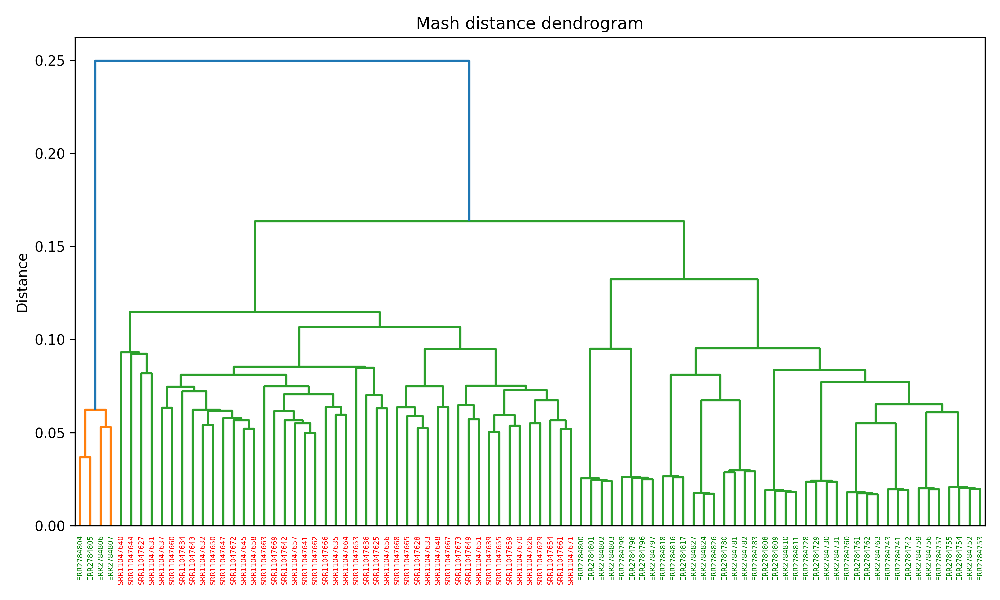

# Hidden Matters

Repository structure:  
`data` - data received after the launch of programs and used for further analysis;  
`imgs` - images from the README text;  
`scripts` - scripts used on the server to process raw sequencing data;  
`notebooks` - notebooks used for data analysis after scripts;  
`modules` - auxiliary functions for notebooks;  
`results` - images obtained as a result of analysis in notebooks.

## Introduction

Metagenomics studies the set of genes of all microorganisms present in an environmental sample, called a metagenome. 
Microbial communities play a key role in maintaining human health. Metagenomic sequencing is used to describe microbial communities in individuals, which helps identify a set of human microbes and understand how changes in the human microbiota correlate with changes in health.

The composition of the human microbiota is related to the state of health. The presence and representation of different bacterial species or families may correlate with certain diseases. In this work, the relationship of the human gut microbiota with arthritis was investigated. 
Data on the intestinal microbiota were obtained from genome-wide sequencing using the shot-gun method. Further, these raw data were processed using bioinformatic tools via the CLI and python. The results of bacterial representation, functional profiling, and pipeline were obtained.

## Goal: 
Search for diagnostics markers for diseases classification based on WGS human gut samples

### Objectives:
- Literature review
- Dataset selection and preprocessing
- Identification of significant features:
    - Taxonomic analysis
    - Functional analysis
    - k-mer analysis
- Training of classification models
- Development of a reproducible data analysis pipeline
- Annotation and interpretation of identified features

## Methods

### Preprocessing
Data were downloaded from site https://www.ncbi.nlm.nih.gov/sra by project number using `SRA Toolkit`. `FastQC` was used for quality control of sequence data before and after filtration. The sequences were filtered using a `Trimmomatic` with the following parameters: ILLUMINACLIP:TruSeq3-PE.fa:2:30:10 (Remove adapters),  LEADING:3 (Remove leading low quality or N bases (below quality 3)), TRAILING:3 (Remove trailing low quality or N bases), SLIDINGWINDOW:4:20 (Scan the read with a 4-base wide sliding window, cutting when the average quality per base drops below 20), MINLEN:60 (Drop reads below 60 bases long).  
[sra](scripts/01_download_metagenomes.sh), [fastqc1](scripts/02_quality.sh), [fastqc2](scripts/02_quality_res.py), [trim](scripts/03_filter.sh)

### Taxonomic classification
The `Kraken2` was used for taxonomic classification based on k-mers [2]. Kraken2 is a fast and memory efficient tool for taxonomic assignment of metagenomics sequencing reads. The result was a abundance table at the species. The `MetaPhlAn4` was used for taxonomic classification based on marker genes. MetaPhlAn4 is a tool for profiling the composition of microbial communities from metagenomic shotgun sequencing data [3]. Output files contain taxon abundances are listed one clade per line, tab-separated from the clade's relative abundance in %.  
[kraken1](scripts/04_kraken.sh), [kraken2](scripts/04_kraken.py), [metaphlan](scripts/04_metaphlan.sh)

### Features
`MetaFX` was used for feature extraction from whole-genome metagenome sequencing data and classification of groups of samples [4]. The analysis was performed on k-mers of size 31. The results: feature table, table of samples categories, contigs in FASTA format as features for each category. `Mash` was used for estimating the distance between metagenomes. Splits sequences into k-mers, makes a MinHash sketch, compares sketches, and gets the distance. Results: table of distance between samples.  
[metafx](scripts/06_metafx.sh), [mash](scripts/05_mash_dist.sh)

### Classification
Preprocessing tables from Kraken2, MetaPhlan, Mash, MetaFX used `pandas`, `numpy`. Preprocessing includes creating metadata with sample group, selection taxonomic level. The Shannon index was used to calculate alpha diversity. `Matplotlib`, `seaborn` was used for visualization. Methods for reduction dimensions: `PCA`, `t-SNE`, `UMAP`. Machine learning (library scikit-learn) was used to train classification models. The `Random Forest` and `Logistic regression` algorithms were used for the task of classifying and evaluating the features importances.  
Analitytic: [kraken](notebooks/kraken_analytic.ipynb), [metaphlan](notebooks/metaphlan_analytic.ipynb), [metafx](notebooks/metafx_analytic.ipynb), [mash](notebooks/mash_analytic.ipynb)

## Data

The data for the analysis of the intestinal microbiome in people with rheumatoid 
arthritis were taken from the article Gupta "Gut microbial determinants of clinically important improvement in patients with rheumatoid arthritis" [1]. The patients were selected from Mayo Clinic (USA). Sequencing data for stool metagenomes used in this study have been deposited at NCBI’s Sequence Read Archive (SRA) data repository (BioProject number PRJNA598446) 49 samples Illumina HiSeq 4000.  
Metagenomes of healthy people were taken from [GMRepo](https://gmrepo.humangut.info/data). Project PRJEB28543. 48 samples.

## Results

### Taxonomic classification

Top-20 species from 

Kraken

MetaPhlan

<!--  -->

### Alpha diversity

Alpha diversity was estimated by the Shannon index. This is a metric for determining the degree of homogeneity of the distribution of features of objects in the sample, for estimating the species diversity of a community.

$H = -\sum_{i=1}^{n} p_i \log_2 p_i$,  

where $p_i$ the number of features of the object.

The absolute index values for Kraken2 are systematically higher than for MetaPhlAn. These discrepancies are probably related to differences in the methodology of the taxonomic classification of Kraken2 and MetaPhlAn. Kraken accounts for a wider range of organisms, including unclassified potential contaminating organisms, whereas MetaPhlAn focuses on well-annotated bacterial markers and is more conservative.  
The Mann-Whitney test was used to evaluate the statistically significant difference within the method between patients and healthy people. As a result, it was found that the difference in the Shannon index between patients and healthy people is not significant: Kraken p-value 0.808, MetaPhlAn p-value: 0.119.
To assess the statistically significant difference between the methods, the Wilcoxon test was used, since the same sample was analyzed by two methods, the data are paired. It is shown that the difference between the methods in the Shannon index is statistically significant with a p-value of 1.67e-11.

### Beta diversity

To assess the differences between the samples, the tool Mash using the MinHash method was used. The Mash function returns the estimate of the Jacquard index, which is the proportion of total k-measures. A low value of Mash distance means a more similar composition of sequences, a high value means a more different one.

### Feature importance

The following features were extracted from MetaFX: for arthritis 9587 features, from health 4014. The following microorgasms turned out to be important features obtained as a result of the Random Forest model from MetaFX, as well as extracted after applying Random Forest and logistic regression after the Kraken2, MetaPhlan taxonomic annotation: *Segatella copri*, *Blautia wexlerae*, *Clostridium*, *Bacteroides*, *Eggerthella lenta*. Bacteria of the genus *Blautia* are associated with the production of short-chain fatty acids, which have a positive effect on intestinal health and immunity. While bacteria of the genus *Segatella* are associated with markers of systemic inflammation and migration of bacterial products into the joint space [5]. Bacteria of the genera *Clostridia* and *Bacteroides fragilis* are noted as protective [6]. *Eggerthella lenta* and *Collinsella aerofaciens* may increase intestinal permeability [7].

## Bibliography

1. Gupta, V.K., Cunningham, K.Y., Hur, B. et al. Gut microbial determinants of clinically important improvement in patients with rheumatoid arthritis. Genome Med 13, 149 (2021). https://doi.org/10.1186/s13073-021-00957-0

2. Wood, D.E., Salzberg, S.L. Kraken: ultrafast metagenomic sequence classification using exact alignments. Genome Biol 15, R46 (2014). https://doi.org/10.1186/gb-2014-15-3-r46

3. Blanco-Míguez, A., Beghini, F., Cumbo, F. et al. Extending and improving metagenomic taxonomic profiling with uncharacterized species using MetaPhlAn 4. Nat Biotechnol 41, 1633–1644 (2023). https://doi.org/10.1038/s41587-023-01688-w

4. Artem Ivanov, Vladimir Popov, Maxim Morozov, Evgenii Olekhnovich, Vladimir Ulyantsev, MetaFX: feature extraction from whole-genome metagenomic sequencing data, Bioinformatics, Volume 42, Issue 2, February 2026, btag018, https://doi.org/10.1093/bioinformatics/btag018

5. Sala-Climent M, Bu K, Coras R, Cedeno M, Zuffa S, Murillo-Saich J, Mannochio-Russo H, Allaband C, Hose MK, Quan A, Choi SI, Nguyen K, Golshan S, Blank RB, Holt T, Lane NE, Knight R, Scher J, Dorrestein P, Clemente J, Guma M. Targeted Microbial Shifts and Metabolite Profiles Were Associated with Clinical Response to an Anti-Inflammatory Diet in Osteoarthritis. Nutrients. 2025 Aug 22;17(17):2729. doi: 10.3390/nu17172729. PMID: 40944120; PMCID: PMC12430150.

6. Scher JU, Abramson SB. The microbiome and rheumatoid arthritis. Nat Rev Rheumatol. 2011 Aug 23;7(10):569-78. doi: 10.1038/nrrheum.2011.121. PMID: 21862983; PMCID: PMC3275101.

7. Dong Y, Yao J, Deng Q, Li X, He Y, Ren X, Zheng Y, Song R, Zhong X, Ma J, Shan D, Lv F, Wang X, Yuan R, She G. Relationship between gut microbiota and rheumatoid arthritis: A bibliometric analysis. Front Immunol. 2023 Mar 1;14:1131933. doi: 10.3389/fimmu.2023.1131933. PMID: 36936921; PMCID: PMC10015446.s

[FastQC](https://github.com/s-andrews/fastqc)  
[Trimmomatic](https://github.com/usadellab/trimmomatic)  
[Kraken 2](https://github.com/DerrickWood/kraken2)  
[Metaphlan](https://github.com/biobakery/MetaPhlAn)  
[MetaFX](https://github.com/ctlab/metafx)  
[Mash](https://mash.readthedocs.io/en/latest/)

